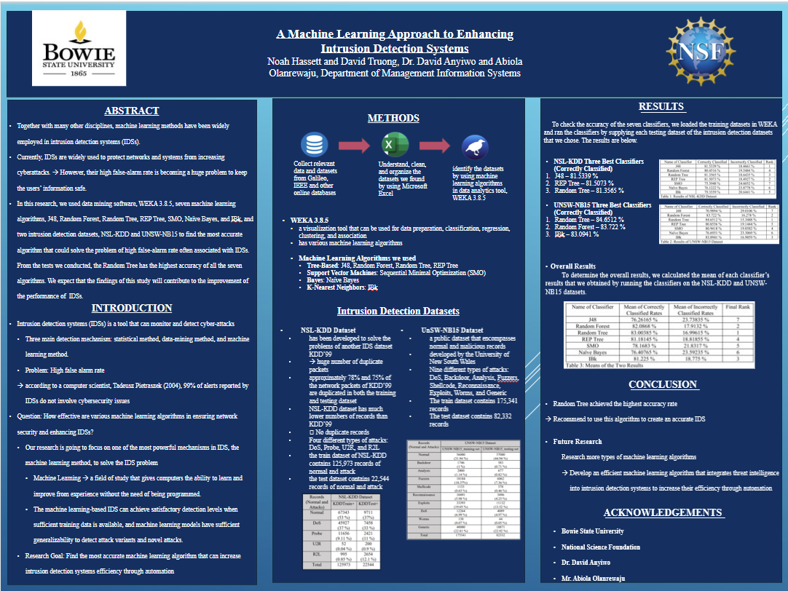

# This is the REU for Bowie State University in Cybersecurity

## What is an REU?
### NSF funds a large number of research opportunities for undergraduate students through its REU Sites program. An REU Site consists of a group of ten or so undergraduates who work in the research programs of the host institution. Each student is associated with a specific research project, where he/she works closely with the faculty and other researchers. 

## REU Objective: aims to provide appropriate and valuable educational experiences for undergraduate students through participation in research. REU projects involve students in meaningful ways in ongoing research programs or in research projects designed especially for the purpose.

# Our Research Title: AN EFFECTIVE APPROACH TO CLOSING THE BREACH DETECTION GAP (BDG) 

## Our Reserach Goal: 
The goal of this research is to find the most accurate machine learning algorithm that can increase IDSs efficiency through automation. By achieving our research goal, we are hoping that our research will provide useful information to advance network security.
This paper is structured as follows. Section 2 presents some related works to our research. Section 3, the methodology, introduced how we conducted the research to achieve our goal. Section 4 shows the results of our research and discusses them. Finally, in section 5, we summarize our research and outlook on future work.

### Team members: 
- Noah
- [David Tan](https://github.com/skytruong90)

### Faculty Mentor: 
- Dr. David E Anyiwo

## How view the paper, poster, and presentation:
1. In order to view the full presentation, going to the folder ``
2. The poster can be view by clicking on the ``
3. The paper can be view by clicking on the ``

## Our research paper:
1. Click on "Research Paper.docx" from above
2. Download it

## Our research poster:

## This is our presentation:
1. Click on "Cyberintelligence Poster.pptx" from above
2. Download it
